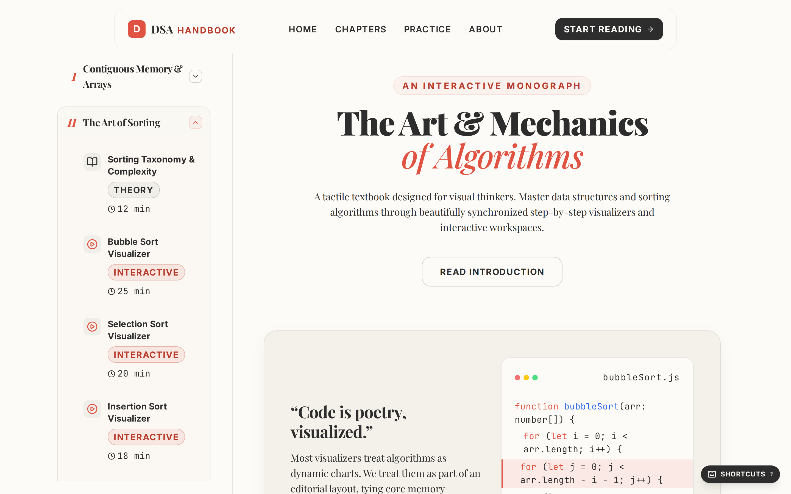
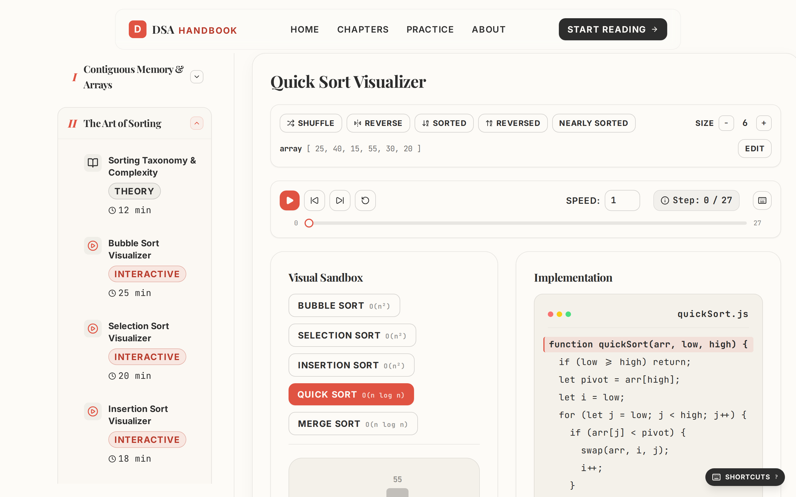
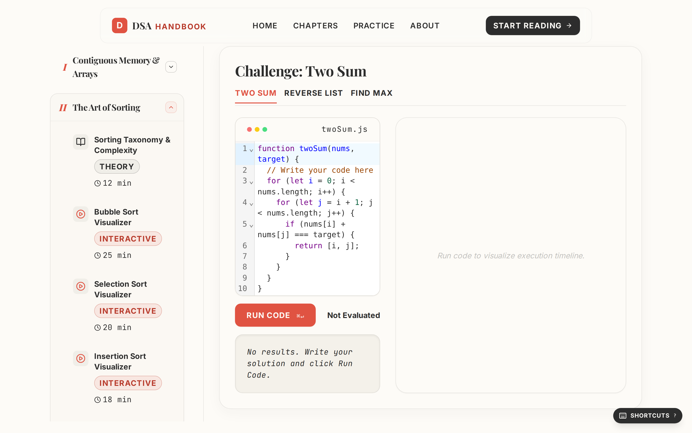
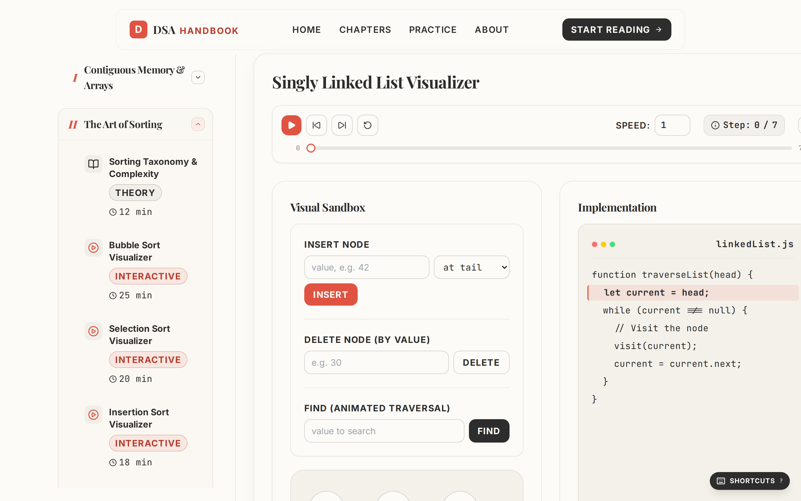

<div align="center">

# 📐 The Interactive DSA Handbook

### _Code is poetry — visualized._

**Stop memorizing algorithms. Start _seeing_ them.**

A tactile, beautifully-crafted textbook for visual thinkers — where every sorting swap, every pointer hop, and every line of code comes alive, step by step, under your fingertips.

[](https://react.dev)
[](https://www.typescriptlang.org)
[](https://vite.dev)
[](https://tailwindcss.com)
[](https://motion.dev)



</div>

---

## ❝ The problem with learning algorithms ❞

Most resources treat algorithms as **walls of static text and pseudocode**. You read `swap(arr, i, j)` a hundred times and still can't _picture_ what the array looks like halfway through a Quick Sort partition.

**This handbook flips that.** It's an interactive monograph where the algorithm runs in front of you like a film you can scrub, pause, rewind, and replay — with the **source code highlighting itself in perfect sync**.

> If you've ever wished a data-structures course came with a _remote control_, this is it.

---

## ✨ What makes it irresistible

### 🎬 A video player for algorithms

Play, pause, step forward, jump to the end, scrub the timeline with a slider, and change playback speed — all driven by the keyboard. The animation and the code light up **in lockstep**, so you always know exactly which line produced what you're seeing.



### 🌈 Five sorting algorithms, zero hand-waving

Bubble · Selection · Insertion · **Quick** (with a live violet pivot) · **Merge** — each one a buttery, flicker-free animation where bars _glide_ into place instead of teleporting. Feed it your own array, shuffle it, reverse it, or hit a worst-case preset and watch the difference in real time.

### 🧠 Built for muscle memory

Every visualizer shares one keyboard language. Learn it once, use it everywhere:

|      Key      | Action              |     |   Key   | Action             |
| :-----------: | :------------------ | --- | :-----: | :----------------- |
|    `Space`    | Play / Pause        |     |   `R`   | Reset              |
|    `←` `→`    | Step back / forward |     | `+` `−` | Speed up / down    |
| `Shift`+`←/→` | Skip 10 steps       |     | `1`–`9` | Set exact speed    |
| `Home` `End`  | First / last frame  |     |   `?`   | Show all shortcuts |

### ⌨️ A real code playground

Solve challenges (Two Sum, Reverse a Linked List, Max Value) in a **full CodeMirror editor** — syntax highlighting, smart indentation, and `⌘/Ctrl + Enter` to run your solution against a live test suite.



### 🔗 Pointers you can finally see

Insert at the head, tail, or any index. Delete by value. Run an **animated traversal** that walks node-by-node while the `current = current.next` line pulses alongside it.



### 🎨 Designed like a magazine, not a tutorial

Editorial typography, a warm paper palette, intentional depth, and motion that _clarifies_ instead of distracts. Every screen is bookmarkable and shareable via deep links (`/sorting?algo=merge`).

---

## 📚 Inside the handbook

| Chapter                                    | What you'll master                         |    Status     |
| ------------------------------------------ | ------------------------------------------ | :-----------: |
| **Contiguous Memory & Arrays**             | Memory layout, Linear & Binary Search      |    ✅ Live    |
| **The Art of Sorting**                     | 5 sorting algorithms, fully interactive    |    ✅ Live    |
| **Dynamic Nodes & Linked Lists**           | Pointers, traversal, insert/delete         |    ✅ Live    |
| **Practice Arena**                         | In-browser coding challenges + test runner |    ✅ Live    |
| Stacks, Queues, Trees, Hash Tables, Graphs | —                                          | 🚧 On the way |

---

## 🚀 Get it running in 30 seconds

```bash
# 1. Install
npm install

# 2. Launch the dev server
npm run dev          # → http://localhost:5173

# 3. Ship a production build
npm run build
npm run preview
```

> **Requirements:** Node 18+. That's it. No backend, no database, no setup ceremony.

---

## 🛠️ Engineered to last

Built on a modern, fast, and maintainable stack:

- **React 18 + TypeScript** (strict) on **Vite 5** — instant HMR, lazy-loaded routes, sub-3s production builds.
- **Tailwind CSS 3** with a custom editorial design-token system.
- **Framer Motion** for compositor-friendly, flicker-free animation.
- **React Router 7** with URL-as-state deep linking.
- **CodeMirror 6** for the coding playground.
- **Playwright** end-to-end coverage across milestone and adversarial suites.

### The architecture that makes it smooth

Every visualizer follows a **record-then-replay** model: the algorithm runs once, ahead of time, and emits an array of immutable frame snapshots. The UI is just a player over `frames[stepIndex]` — so stepping backward is free, playback never blocks, and adding a new algorithm means appending **one entry to a registry**. The full write-up lives in [`INTERACTIVE_UPGRADE.md`](INTERACTIVE_UPGRADE.md).

---

## 🗺️ Roadmap

- [ ] Stacks & Queues visualizer
- [ ] Binary Tree traversals (in/pre/post-order, BFS)
- [ ] Hash Table collision strategies
- [ ] Graph algorithms (BFS, DFS, Dijkstra)
- [ ] Shareable replay links with embedded custom inputs

---

<div align="center">

### Learn the _why_, not just the _what_.

_Designed with an editorial eye. Made with ♥ for computer science._

</div>

---

> 📸 **Note on screenshots:** the images above are referenced from `docs/screenshots/`. Save your captured PNGs there as `home.png`, `sorting.png`, `practice.png`, and `linked-list.png` to make them render in this README.
