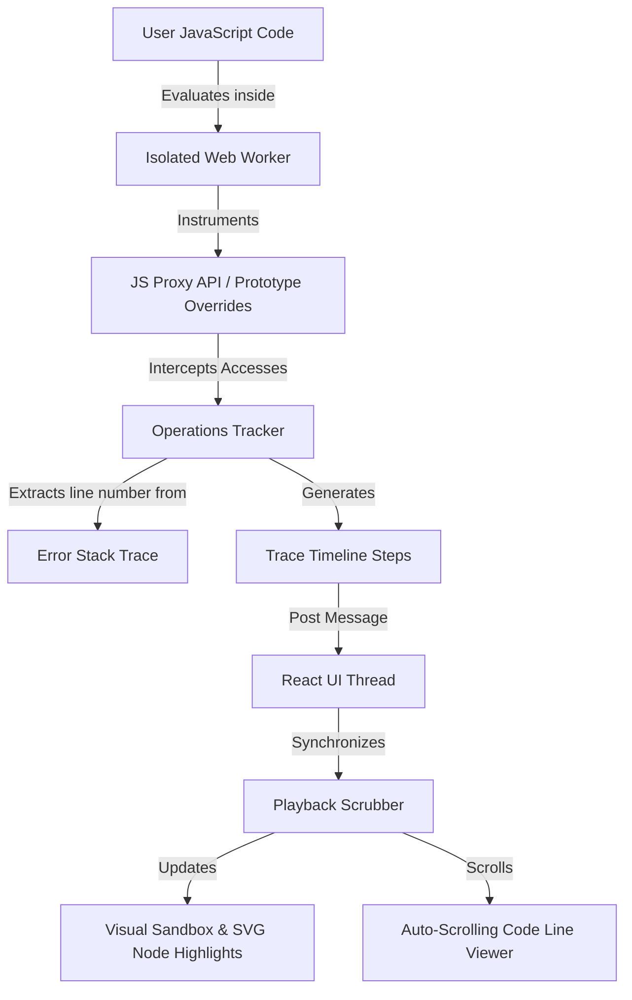

# Challenge Visualizer Techniques & Architecture

This document details the advanced engineering techniques and layout architecture implemented in the **Practice/Challenge** section of the Interactive DSA Handbook.



---

## 1. Instrumented Sandboxed Execution

To execute user-submitted code safely and trace its operations line-by-line without blocking the browser's main thread, the visualizer implements a **Web Worker-based sandboxed runtime** paired with dynamic **JavaScript Proxies**.

### A. Thread Isolation & Security Shadowing
When the user clicks **Run Code**, a dynamic `Blob` containing a sandboxed wrapper script is generated on the fly, initializing a background browser `Worker` (implemented in [PracticeSection.tsx](../src/features/practice/components/PracticeSection.tsx#L1192-L1224)):
* **No Main Thread Blocking**: Code execution runs in a background thread, preventing heavy or infinite loops in user code from locking the user interface.
* **API Shadowing**: To prevent malicious actions (e.g., accessing local storage or network interfaces), critical browser objects (`self`, `fetch`, `XMLHttpRequest`, `WebSocket`, `Worker`, `postMessage`, `importScripts`) are shadowed with `undefined` using a custom function closure.
* **Global Freezing**: Prototype objects of standard constructors (`Object`, `Array`, `String`, `Promise`, etc.) are frozen using `Object.freeze` to prevent prototype pollution or runtime alterations.

### B. JavaScript Proxy API (Access Tracking)
To generate the execution trace list dynamically, parameters passed to the user's function are wrapped in custom **JavaScript Proxies** (implemented in [PracticeSection.tsx](../src/features/practice/components/PracticeSection.tsx#L1343-L1400)):
* **Array Access Interception (Two Sum, Find Max, Binary Search)**:
  An array proxy intercepts `get` operations. When user code reads an index (e.g., `arr[i]`), the proxy intercepts the call and logs a step:
  ```javascript
  const arrayProxy = new Proxy(arr, {
    get(target, prop) {
      if (typeof prop === 'string' && !isNaN(Number(prop))) {
        const idx = Number(prop);
        tracker.push({ type: 'access', index: idx, value: target[idx] });
      }
      return target[prop];
    }
  });
  ```
* **Linked List Pointer Interception (Reverse List)**:
  A custom proxy wraps linked list nodes, logging when pointer fields (like `.next`) are read or modified (e.g., `curr.next = prev`):
  ```javascript
  const nodeProxy = new Proxy(node, {
    get(target, prop) {
      if (prop === 'next') {
        tracker.push({ type: 'get_next', node: target.val, nextNode: target.next?.val });
      }
      return wrapNode(target[prop]);
    },
    set(target, prop, value) {
      if (prop === 'next') {
        tracker.push({ type: 'set_next', node: target.val, nextNode: value?.val });
      }
      target[prop] = value;
      return true;
    }
  });
  ```
* **Stack State Overriding (Valid Parentheses)**:
  `Array.prototype.push` and `Array.prototype.pop` are overridden globally inside the worker. When items are pushed to or popped from an array stack, the overrides capture the action and log the full state of the stack for physical rendering.

### C. Error Stack Source-Mapping (Line-by-Line Highlight)
Every tracked operation determines which line of user code triggered it by instantiating a lightweight `Error` and parsing its stack trace (implemented in [PracticeSection.tsx](../src/features/practice/components/PracticeSection.tsx#L1316-L1332)):
```javascript
function getLineNumber() {
  const err = new Error();
  const stack = err.stack;
  if (!stack) return null;
  const lines = stack.split('\n');
  for (let i = 1; i < lines.length; i++) {
    const match = lines[i].match(/<anonymous>:(\d+):/);
    if (match) {
      // Offset matches compiled Function wrap headers
      return Math.max(1, parseInt(match[1], 10) - 3);
    }
  }
  return null;
}
```
This enables the visualizer to map each array access, comparison, or variable assignment directly back to the specific line of code in the code viewer.

---

## 2. Playback Simulation & Focus Scroll Synchronization

Once execution finishes, the generated array of trace steps is sent back to the main thread to populate the **Timeline Controls**.

### A. Infinite-Loop Free Playback Hook
To animate steps on the screen, a bulletproof React playback effect runs a timer using `setInterval` (implemented in [PracticeSection.tsx](../src/features/practice/components/PracticeSection.tsx#L533-L551)):
* **Dependency Minimization**: The playing effect depends strictly on `[isPlaying, totalSteps, speedMs]`. By excluding `stepIndex` from the dependencies list, the interval runs stably once without being cleared and re-created on every step tick, avoiding infinite render loops.
* **Auto-End State**: Once `stepIndex` reaches the final step, the interval calls `setIsPlaying(false)`, cleaning up the timer and changing the state back to a paused state.

### B. Double-Scroll Highlight Sync
As the scrubber plays, two separate elements automatically scroll to maintain focal tracking:
* **Active Statement Auto-Scroll**:
  The Code Viewer highlights the line currently being executed and computes its offset, centering it within the code viewer panel:
  ```tsx
  useEffect(() => {
    if (activeLine && codeViewerRef.current) {
      const activeEl = codeViewerRef.current.querySelector(`[data-line="${activeLine}"]`);
      if (activeEl) {
        codeViewerRef.current.scrollTop = activeEl.offsetTop - codeViewerRef.current.offsetTop - (codeViewerRef.current.clientHeight / 2);
      }
    }
  }, [activeLine]);
  ```
* **Timeline Log Auto-Scroll**:
  The scrollable trace timeline list keeps the active log item centered:
  ```tsx
  useEffect(() => {
    if (traceListRef.current) {
      const activeEl = traceListRef.current.children[stepIndex] as HTMLElement;
      if (activeEl) {
        traceListRef.current.scrollTo({
          top: activeEl.offsetTop - traceListRef.current.offsetTop - 10,
          behavior: "smooth",
        });
      }
    }
  }, [stepIndex]);
  ```

---

## 3. Responsive Resizable Column Layout

To offer a professional development environment on desktop screens, the workspace features an adjustable divider handle separating the Editor from the Visualizer.

* **Split Layout (`react-resizable-panels`)**:
  Integrates a resizable flex splitter on large screens using the Group and Separator components.
* **Adaptive Stacking**:
  Uses `@mantine/hooks` `useMediaQuery` to detect viewport width.
  - **Desktop Viewport (`>= 1024px`)**: Renders a horizontal `PanelGroup` allowing users to drag and customize column widths.
  - **Mobile/Tablet Viewport (`< 1024px`)**: Gracefully falls back to a stacked vertical layout where the Editor and Visualizer sit on top of each other.
* **Cohesive Drag Handle**:
  The resize separator has a custom hover vertical pill which illuminates in coral (`group-hover:bg-coral`) during interaction to match the handbook's aesthetics.
* **Vertical Height Alignment**:
  By removing `items-start` and wrapping the child cards in `h-full self-stretch`, both the left editor panel and the right visualizer panel stretch to match each other's height exactly, ensuring clean alignment (implemented in [PracticeSection.tsx](../src/features/practice/components/PracticeSection.tsx#L845-L847)).

---

## 4. Visual Sandbox Renderers

The **Visual Sandbox** renders distinct UI modules depending on the selected challenge type:

| Challenge | Visual Sandbox Renderer | Highlights & Transitions |
| :--- | :--- | :--- |
| **Two Sum** | `ArrayVisualizer` | Yellow highlight for index comparisons, emerald green for solution indices. |
| **Find Max** | `ArrayVisualizer` | Active cell gets yellow highlighting. Running maximum position is tracked. |
| **Reverse List** | `LinkedListVisualizer` | Custom SVG node circles and directed paths. Nodes highlight red when pointer properties update. |
| **Binary Search** | `BinarySearchVisualizer` | Dynamic low, mid, and high text pointers. Narrowing range dims out-of-bounds cells. |
| **Valid Parentheses** | `StackParenthesesVisualizer` | Characters split into boxes. Pushing or popping brackets trigger Framer Motion springs on a physical stack bucket. |
